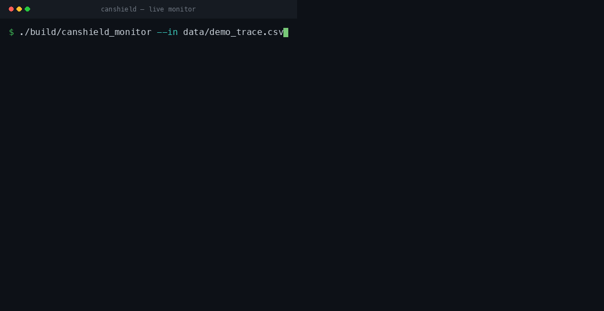
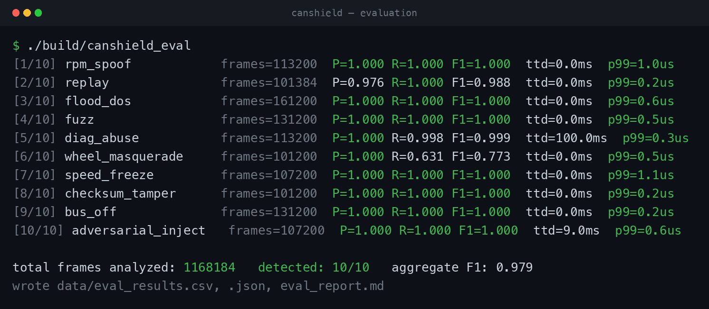
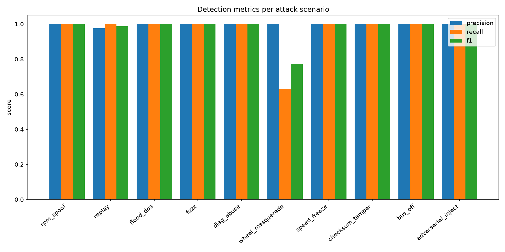

# CANShield

small project i made to learn how CAN bus security works. it fakes a car's ECUs talking to
each other over CAN, throws a bunch of attacks at the bus, and a C++ program tries to catch
them while everything is running.

it runs on a normal laptop using a fake in-memory bus, or on a raspberry pi with real
socketcan (vcan0/can0). same code either way.



## what it does

- simulates the ECUs (engine, abs, body, etc) with a little physics model so the numbers make
  sense (rpm goes up with speed and so on)
- made up my own "proprietary" message format with a rolling counter + checksum and reverse
  engineered it, writeup is in docs/protocol-reverse-engineering.md
- 10 attacks: spoofing, replay, flooding, fuzzing, diagnostic abuse, ecu masquerade, speed
  freeze, checksum tamper, bus-off, and an adversarial injection one
- the monitor has 9 detectors (timing, rate, checksum, counter, range, unknown id, protocol,
  physics, diagnostic) and times how long each frame takes to check
- small offensive bit too: a uds securityaccess (seed/key) exploit that unlocks a fake
  diagnostic ecu, writeup in docs/uds-securityaccess-attack.md

## results

i ran all 10 attacks over about 1.17 million frames. it caught all 10.

- precision ~1.0, recall ~0.96, f1 ~0.98
- per frame checking latency was around 1 microsecond at p99 (i was aiming for under 1 ms)

the one that isnt great is the masquerade attack (recall ~0.63). thats kind of expected, if a
fake ECU copies everything perfectly you can only catch it when its values dont match the rest
of the bus. numbers are in docs/evaluation.md.





## building it

you need cmake and a c++17 compiler.

```sh
cmake -S . -B build && cmake --build build -j
ctest --test-dir build
./build/canshield_eval
```

quick demo (make an attack file then run the monitor on it):

```sh
./build/canshield_attack --attack rpm_spoof --out data/trace.csv
./build/canshield_monitor --in data/trace.csv
```

offensive demo (recover a diagnostic ecu's seed/key and unlock it):

```sh
./build/canshield_exploit
```

charts need matplotlib:

```sh
python3 -m venv .venv && .venv/bin/pip install -r analysis/requirements.txt
.venv/bin/python analysis/plot_results.py
```

## on a raspberry pi

theres a longer version in docs/deployment-raspberry-pi.md. basically set up vcan0 with
scripts/setup_vcan.sh, build, run the sim in one terminal and
`./build/canshield_monitor --iface vcan0` in another.

## folders

- include/ and src/ is the actual library
- apps/ is the command line tools
- tests/ is the unit tests
- docs/ has the writeups
- analysis/ is the python plotting
