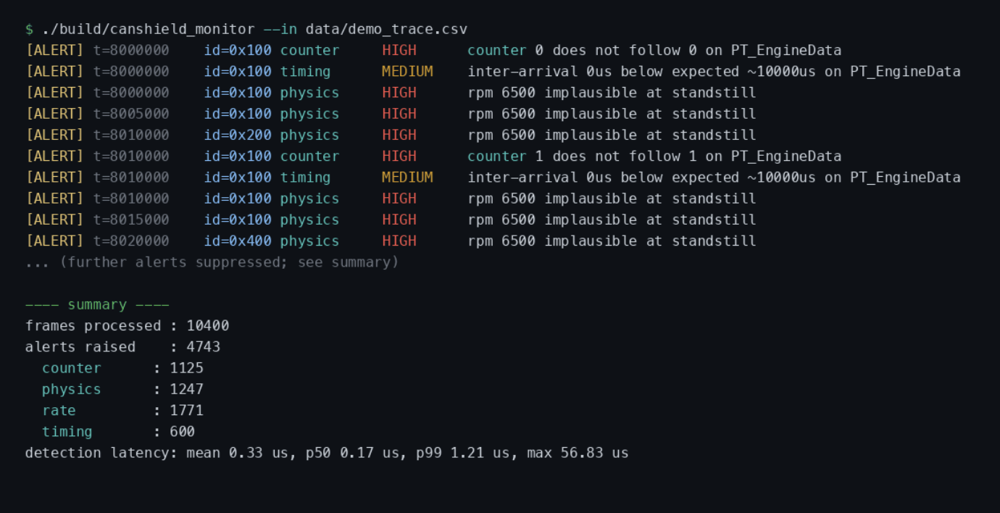

# canshield

a small project i made to learn how car networks get attacked and how you'd catch it.

it fakes a car's ecus talking over can bus, throws 10 attacks at the bus, and a c++ monitor tries to catch them live. runs on a laptop with a fake bus or on a raspberry pi with a real one, same code either way.



## what's in it

- fake ecus (engine, abs, body) with a bit of physics so the numbers make sense
- my own made up message format with a counter and checksum, which i then reverse engineered
- 10 attacks: spoofing, replay, flooding, fuzzing, diag abuse, masquerade, speed freeze, checksum tamper, bus-off and a sneaky injection one
- a monitor with 9 checks: timing, rate, checksum, counter, range, unknown id, protocol, physics and diag
- a small uds seed/key exploit that unlocks a fake diag ecu

## how it did

ran all 10 attacks over about 1.17m frames and caught all 10.

- precision 1.0, recall 0.96, f1 0.98
- checking a frame takes about 1 µs at p99 (the goal was under 1 ms)

the weak spot is masquerade (recall 0.63). if a fake ecu copies everything perfectly, you can only catch it when its values don't line up with the rest of the car.


## run it

you need cmake and a c++17 compiler. the quickest way is `scripts/run_demo.sh`, which builds, tests and runs a demo for you.

or do it yourself:

```sh
cmake -S . -B build && cmake --build build -j
ctest --test-dir build
```

make an attack and watch it get caught:

```sh
./build/canshield_attack --attack rpm_spoof --out data/trace.csv
./build/canshield_monitor --in data/trace.csv
```

- full eval: `./build/canshield_eval`
- exploit demo: `./build/canshield_exploit`
- all the monitor flags: `./build/canshield_monitor --help`

## on a pi

run `scripts/setup_vcan.sh`, build, then start the sim in one terminal and `./build/canshield_monitor --iface vcan0` in another. more in `docs/deployment-raspberry-pi.md`.

## more

the writeups are in `docs/` if you want the details.
