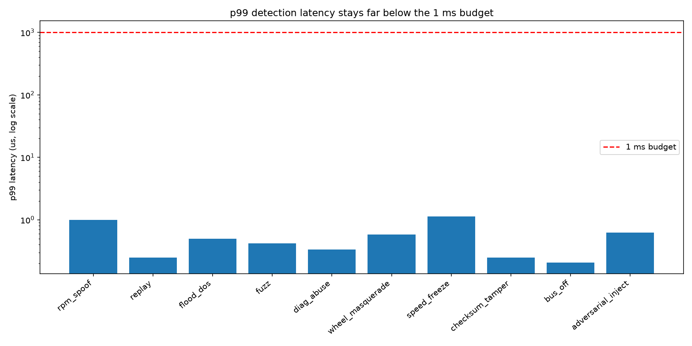

# evaluation

This is the writeup around the numbers. The raw report is regenerated by
`./build/canshield_eval` into `data/eval_report.md` (+ `.csv` / `.json`); the tables below are
a snapshot of a full run.

## method

- **Traffic**: for each of the 10 attacks, generate a *fresh* benign trace (its own RNG seed)
  of 220 s of driving, then overlay the attack in a 60 s window `[90 s, 150 s]`. Fresh traffic
  per scenario means the ~1.17 M frames are genuinely distinct, not one baseline recounted.
- **Scoring unit = 10 ms time buckets.** A bucket is labeled *attack* if it contains any
  injected frame, and *flagged* if the IDS raised any alert in it. Precision/recall/F1 are
  computed over buckets. This is the standard way to score CAN IDS, and it avoids an unfair
  per-frame artifact: injection attacks manifest on a *pair* of frames (a real frame arriving
  right after a spoofed one), so the alert can land on the real frame — bucketing counts that
  as the correct catch instead of a false positive + a miss.
- **Two latencies are reported.** *Per-frame detection latency* is how long the detector chain
  takes on one frame (the `< 1 ms` headline). *Time-to-detect* is how long after attack onset
  the first alert fires.

## results (full run, ~1.17M frames)

- frames analyzed: **1,168,184**
- attacks detected: **10 / 10**
- aggregate precision **1.000**, recall **0.959**, F1 **0.979**

| scenario | attack frames | precision | recall | F1 | time-to-detect |
|---|--:|--:|--:|--:|--:|
| rpm_spoof | 12000 | 1.000 | 1.000 | 1.000 | 0 ms |
| replay | 184 | 0.976 | 1.000 | 0.988 | 0 ms |
| flood_dos | 60000 | 1.000 | 1.000 | 1.000 | 0 ms |
| fuzz | 30000 | 1.000 | 1.000 | 1.000 | 0 ms |
| diag_abuse | 12000 | 1.000 | 0.998 | 0.999 | 100 ms |
| wheel_masquerade | 6000 | 1.000 | 0.631 | 0.773 | 0 ms |
| speed_freeze | 6000 | 1.000 | 1.000 | 1.000 | 0 ms |
| checksum_tamper | 6000 | 1.000 | 1.000 | 1.000 | 0 ms |
| bus_off | 30000 | 1.000 | 1.000 | 1.000 | 0 ms |
| adversarial_inject | 6000 | 1.000 | 1.000 | 1.000 | 9 ms |

## latency

Per-frame detection latency, single-threaded on a laptop (microseconds):

| scenario | mean | p50 | p99 | p99.9 | max |
|---|--:|--:|--:|--:|--:|
| rpm_spoof | 0.2 | 0.2 | 1.0 | 1.2 | 41.1 |
| flood_dos | 0.3 | 0.2 | 0.5 | 0.6 | 42.5 |
| fuzz | 0.2 | 0.2 | 0.4 | 0.7 | 42.2 |
| wheel_masquerade | 0.2 | 0.2 | 0.6 | 0.7 | 36.5 |
| checksum_tamper | 0.2 | 0.2 | 0.2 | 1.1 | 41.0 |
| adversarial_inject | 0.2 | 0.2 | 0.6 | 0.7 | 36.2 |

p99 is ~1 µs and even the worst-case single-frame max (~40 µs, a cold-cache outlier) is
~25× under the 1 ms budget.

## reading the results

- **Loud attacks** (flood, fuzz, bus-off, diag) are trivially caught — they either use unknown
  ids, break structure, or spike the rate.
- **Integrity attacks** (checksum tamper, replay) are caught cleanly by the recovered
  checksum/counter, near-perfectly.
- **`replay` precision 0.976** is the only sub-1.0 precision: a couple of benign buckets right
  at the replay boundary get flagged. Cheap trade for 1.0 recall.
- **`wheel_masquerade` recall 0.63** is the real limitation, discussed in
  `attack-scenarios.md`: a structurally-perfect impersonation is only detectable when its
  values contradict the rest of the bus, which isn't true during low-speed phases.

## caveats

- Traffic is synthetic and the bus matrix is small (7 periodic ids). Real buses have hundreds
  of ids and messier timing — thresholds would need retuning.
- Detectors are rule/threshold based (no ML). That's deliberate: it's interpretable and cheap,
  which is what the latency budget wants. A learned per-id timing model would be the next step.
- The virtual bus has no arbitration/bit-timing, so flood "bus starvation" is modeled by rate,
  not by physically delaying other frames.
